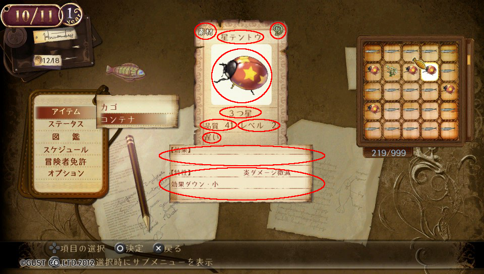

# 素材アイテムを見る

## 要素を洗い出す

ゲーム中、画面上に見える項目を洗い出してみる。

### アイテム情報画面
まずはアイテム情報画面から。



確認できる要素は10項目。
- カテゴリ
- 名前
- 品質ランク
- イメージ
- 品質の称号
- 品質
- コストレベル
- 劣化速度/充填速度
- 効果一覧
- 特性一覧

## コード化してみる

洗いだした情報をコードに起こしてみる。

### 無理やり基本要素に充ててみる
```java
class MaterialItem {
    String categoryName;
    String name;
    String qualityRank;
    Image image;
    String qualityTitle;
    Byte quality;
    Byte costLevel;
    String qualityVary;
    String[] effects;
    String[] properties;
}
```

実際に使うこのクラスを使うシーンを考えると、とてもじゃないが使えないので、
オブジェクティブ指向エクササイズの要素である以下の項目に沿って、プロパティを整理してみる。
- 全てのプリミティブとstringをラップする
- 3つ以上のインスタンス変数を持ったクラスは使わない


### 全てのプリミティブとstringをラップする

#### カテゴリの名前について
「名前」とは、とても広範囲に存在するため、名前という要素を持つ、「カテゴリ」クラスを作成する。

```java
class Name {
    String value;
}
class Category {
    Name name;
}
class MaterialItem {
    Category category;
    String name;
    String qualityRank;
    Image image;
    String qualityTitle;
    Byte quality;
    Byte costLevel;
    String qualityVary;
    String[] effects;
    String[] properties;
}
```

#### アイテムの名前
カテゴリと同様に、Nameクラスを使う

```java
class Name {
    String value;
}
class MaterialItem {
    Category category;
    Name name;
    String qualityRank;
    Image image;
    String qualityTitle;
    Byte quality;
    Byte costLevel;
    String qualityVary;
    String[] effects;
    String[] properties;
}
```

#### ランク
この項目の名前つけは若干難しいところがある。値は品質によって決定されるが、
意味合いとしては、アイテムに直接紐づくものであるため。

```java
class Rank {
}
class MaterialItem {
    Category category;
    Name name;
    Rank rank;
    Image image;
    String qualityTitle;
    Byte quality;
    Byte costLevel;
    String qualityVary;
    String[] effects;
    String[] properties;
}
```

```java
class Name {
    String value;
}

class Quality {
    Byte value;
    Byte Rank();
}

class QualityTitles {
    String[] values;
}

class CostLevel {
    Byte value;
}

class Effect {
    Name name;
}
class EffectList {
    Effect[] data;
}

class Property {
    Name name;
}
class PropertyList {
    Property[] data;
}
```
